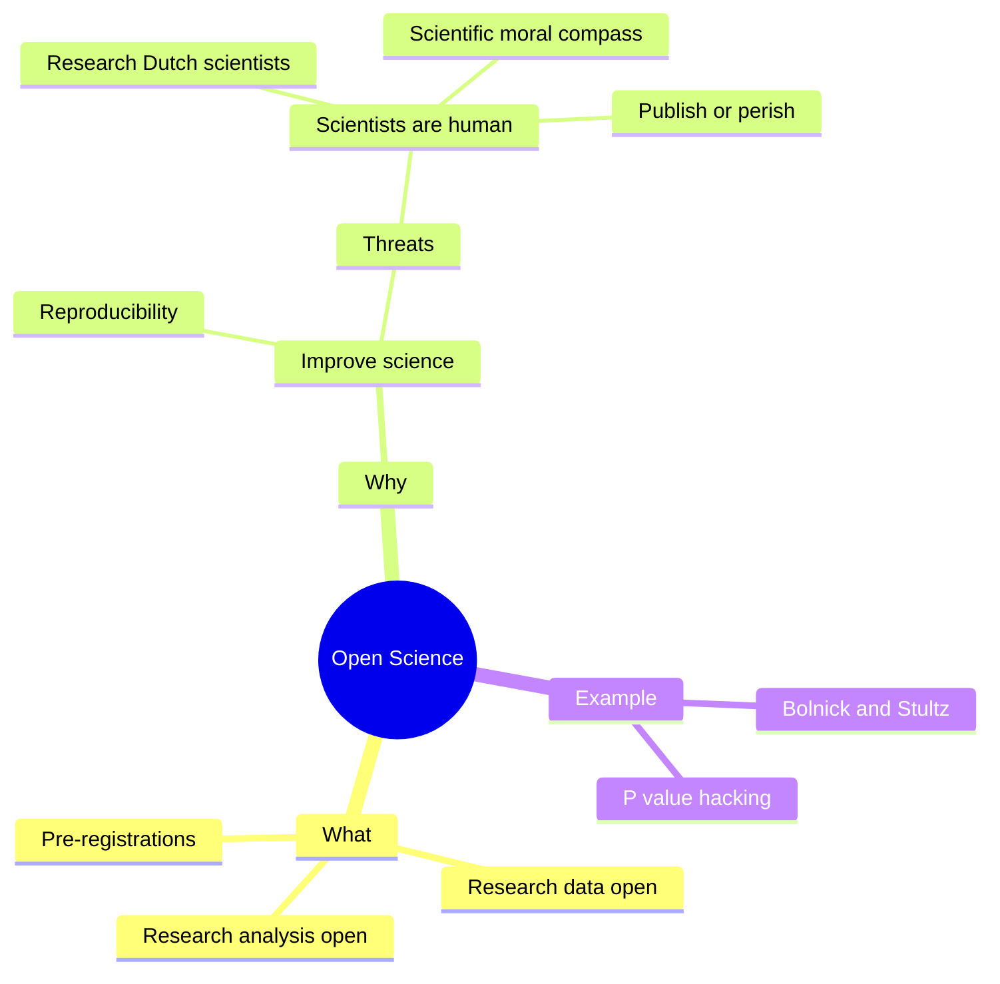

# science_fika_open_science_20250316

Science Fika talk about Open Science, in Swedish.

```mermaid
mindmap
  root((Open Science))
    What
      Research data open
      Research analysis open
      Pre-registrations
    Why
      Improve science
        Reproducibility
        Threats
          Scientists are human
            Research Dutch scientists
            Publish or perish
            Scientific moral compass
    Example
      Bolnick and Stultz
      P value hacking
```
