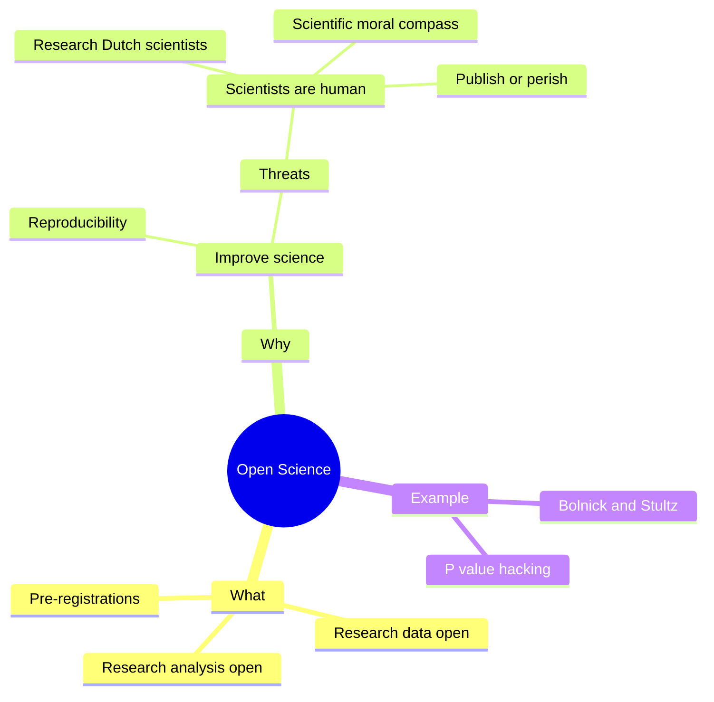

# science_fika_open_science_20250316

Science Fika talk about Open Science, in Swedish.

- Title: Oppen Forsking: som vanligt forskning, men bättre

## Working abstract

Forskning kanske verkar att funkar bäst att upptäcka kunskap,
men det finns en effect som gör forskning att inte går rakt framåt:
forskare. 

Det är för att forskare är manniska, som också tänker of mänskliga saker
som karrier, familj, usw.
För att göra forskningen bättre ändå finns det nu Open Forskning,
som tar hand om detta också.
Under den här samtal visar författaren,
som är skapare av Open Science Community Uppsala,
varför Open Forskning är nödvändigt.

## Mindmap

